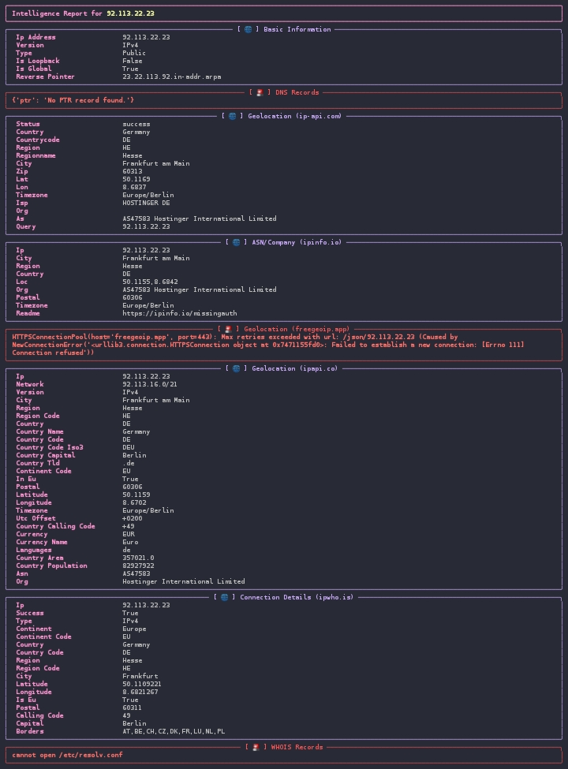

# أداة استخبارات IP

أداة قوية لاستخبارات عناوين IP تعمل من سطر الأوامر، مكتوبة بلغة بايثون. تقوم هذه الأداة بجمع معلومات شاملة عن أي عنوان IP من عدة مصادر عامة وتقدمها في شكل منظم وواضح.

## المميزات

-   **بيانات شاملة:** تجمع المعلومات من عدة مصادر مختلفة لا تتطلب مفتاح API.
-   **عرض جذاب وواضح:** تستخدم مكتبة `rich` لعرض البيانات في جداول ومنسقة.
-   **إرسال إلى تليجرام:** خيار لإرسال التقرير الكامل إلى محادثة في تليجرام، شاملاً خريطة الموقع.
-   **فحص تلقائي للمكتبات:** تقوم بتثبيت المكتبات الناقصة تلقائياً عند أول تشغيل.
-   **معالجة قوية للمدخلات:** تقوم بتنظيف المدخلات لمنع الأخطاء.
-   **استخدام مرن:** يمكن تشغيلها بشكل تفاعلي أو عبر تمرير الـ IP كمدخل لسطر الأوامر.

## الإعدادات (اختياري)

لتمكين ميزة إرسال التقارير إلى تليجرام، يجب عليك تعديل ملف `ip_info.py` وإضافة المعلومات التالية:

1.  **توكن البوت (`TELEGRAM_BOT_TOKEN`):** احصل عليه عن طريق إنشاء بوت جديد من خلال محادثة `@BotFather` على تليجرام.
2.  **معرف المحادثة (`TELEGRAM_CHAT_ID`):** احصل عليه عن طريق إرسال رسالة إلى بوت `@userinfobot` على تليجرام.

## البدء السريع

**١. نسخ المستودع**

```bash
git clone https://github.com/Hmza1112617/IP-Intelligence-Tool.git
```

**٢. الدخول إلى المجلد**

```bash
cd IP-Intelligence-Tool
```

**٣. تشغيل الأداة**

```bash
# للوضع التفاعلي
python ip_info.py

# لتحليل IP مباشرة
python ip_info.py 8.8.8.8
```

---

# IP Intelligence Tool

A powerful, console-based IP intelligence tool written in Python. This script gathers extensive information about any given IP address from multiple public, keyless sources and presents it in a clean, human-readable format.

## Features

-   **Comprehensive Data:** Gathers information from multiple different keyless sources.
-   **Rich & Clean Output:** Uses the `rich` library to display data in beautifully formatted panels and tables.
-   **Telegram Integration:** Option to send the full report to a Telegram chat, including a location map.
-   **Automatic Dependency Check:** Automatically detects and installs missing Python libraries.
-   **Robust Input Handling:** Sanitizes input to prevent errors.
-   **Flexible Usage:** Can be run interactively or by passing an IP address as a command-line argument.

## Configuration (Optional)

To enable the Telegram reporting feature, you must edit the `ip_info.py` file and add the following:

1.  **Bot Token (`TELEGRAM_BOT_TOKEN`):** Get it by creating a new bot by talking to `@BotFather` on Telegram.
2.  **Chat ID (`TELEGRAM_CHAT_ID`):** Get it by sending a message to the `@userinfobot` bot on Telegram.

## Getting Started

**1. Clone the Repository**

```bash
git clone https://github.com/Hmza1112617/IP-Intelligence-Tool.git
```

**2. Navigate to the Directory**

```bash
cd IP-Intelligence-Tool
```

**3. Run the Tool**

```bash
# For interactive mode
python ip_info.py

# To analyze an IP directly
python ip_info.py 8.8.8.8
```

---
## Credits

Telegram: @DRR_R2 - @phpandpy
